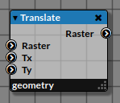

# Translate

_Node applying a translation to a 2D Raster._

|  |
|------------------------|
|Legend|

## 1. Inputs

### 1.1. Raster

_This node takes as input a 2D Raster_.

### 1.2. Tx

_The X-coordinate of the Translate Vector._
_By default, `Tx` is equal to <kbd>0</kbd>._

### 1.3. Ty

_The Y-coordinate of the Translate Vector._
_By default, `Ty` is equal to <kbd>0</kbd>._

## 2. Properties
   

## 3. Outputs

### Raster

_A translated 2D Raster_

## 4. Example

| Example |
|------------------------|
|TODO|

## 5. See also

- Transform
- Rotate
- Scale

