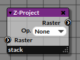

# Z-project

_Node emitting a 2D Raster from a stream of rasters (aka Stack)_

|  |
|------------------------|
|Legend|

## 1. Inputs

_This node takes as input a 2D Raster_.

## 2. Properties
   
### Op.

_The text area allows to define iterable objects like String or Array (see below for description)._

## 3. Outputs

### Output Name

_A stream of items_

## 4. Example

| Example |
|------------------------|
|The _Z-project_ returns a single z-projected raster|
|corresponding to the average of the rasters stream.|

